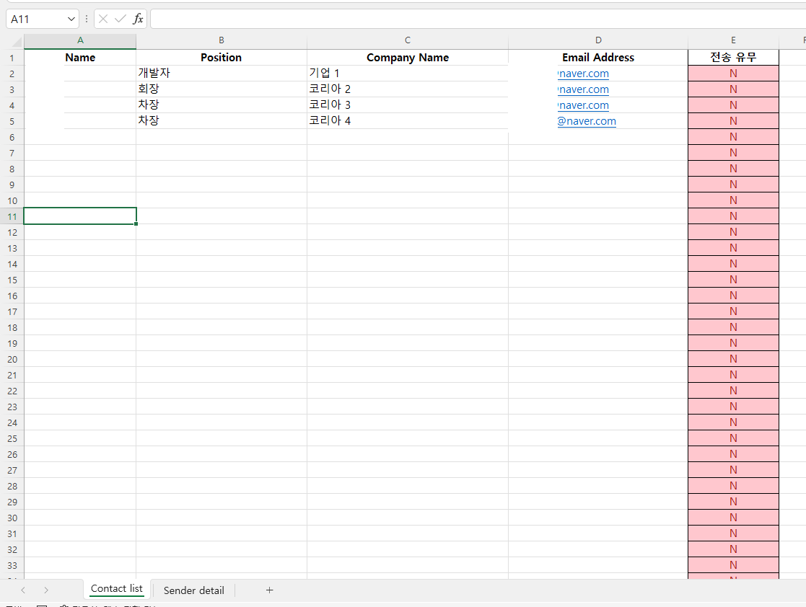

# ExcelEmailSender
Sends out email based on Excel list

Forms an email content corresponding to provided list of info: Name, Position, Company Name, Email Address.

And based on the given SMTP service, it sends out email to all recipients from the list.


## 1. Sheet 1

### List of users



## 2. Sheet 2

### Config for your smtp server.
   
   

## 3. Change variables and content values

Change list range first.

If you want to selectively send email from A2 to A5 set below code to ` For i = 2 To 5`
```angular2html
Sub Main()
        Call setSmptData
        Dim i As Integer
        For i = 2 To 5
            Call SendMailTo(i)
        Next i
    End Sub

```

Edit content in `Sub setMailContent(name As String, position As String, company As String)`

---
## Result

 If you run the module, you'll get a email looking like below.
